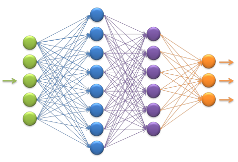
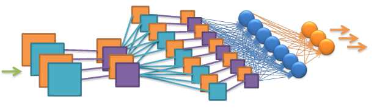
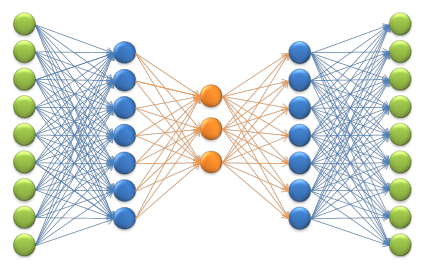
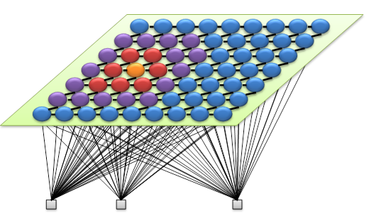
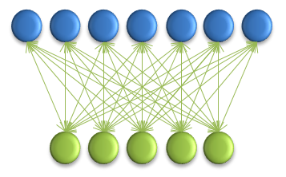
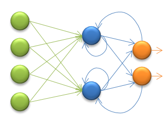
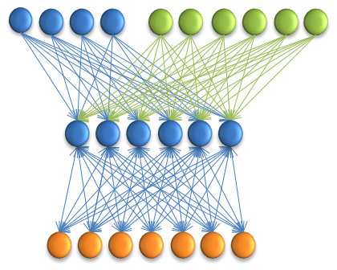
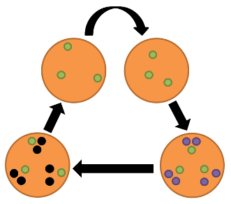

===========================
Machine Learning Algorithms
===========================

Currently Veles ML algorithms are Neural Networks as Znicz plugin and Genetic
Algorithm as Genetic in Veles core. Znicz is a submodule of Veles.

"""""""""""""""
Neural Networks
"""""""""""""""

*******************************
Fully-connected Neural Networks
*******************************

Status:

1. All necessary units developed for CUDA, OPENCL and NUMPY
2. Workflow was created and tested
3. Examples of Workflows:

   1. Softmax NN custom workflow: MnistSimple/mnist.py MnistSimple/mnist_config.py. Download: https://velesnet.ml/forge/fetch?name=MnistSimple&version=master

   2. Softmax NN with standard workflow help: MNIST/mnist.py MNIST/mnist_config.py. Download: https://velesnet.ml/forge/fetch?name=MNIST&version=master

   3. MSE NN with standard workflow help: Kanji/kanji.py Kanji/kanji_config.py Download: https://velesnet.ml/forge/fetch?name=Kanji&version=master

4. Usage example: MNIST/mnist_forward.py. Download: https://velesnet.ml/forge/fetch?name=MNIST&version=master
5. Results: 1.48% validation errors on MNIST

*****************************
Convolutional Neural Networks
*****************************

Status:

1. All necessary units developed for CUDA, OPENCL and NUMPY
2. Workflow was created and tested
3. Examples of Workflow:

   1. CIFAR/cifar.py CIFAR/cifar_caffe_config.py. Download: https://velesnet.ml/forge/fetch?name=CIFAR10&version=master

   2. AlexNet/imagenet_workflow.py AlexNet/imagenet_workflow_config.py. Download: https://velesnet.ml/forge/fetch?name=AlexNet&version=master

4. Usage example: AlexNet/ImagenetForward.ipynb. Download: https://velesnet.ml/forge/fetch?name=AlexNet&version=master
5. Results: 17.21% validation errors on CIFAR10
            35.10% validation errors on STL10

***************************
Autoencoder Neural Networks
***************************

Status:

1. All necessary units developed for CUDA, OPENCL and NUMPY
2. Workflow was created and tested
3. Examples of Workflow:

   1. MnistAE/mnist_ae.py MnistAE/mnist_ae_config.py. Download: https://velesnet.ml/forge/fetch?name=MnistAE&version=master

   2. VideoAE/video_ae.py VideoAE/video_ae_config.py. Download: https://velesnet.ml/forge/fetch?name=VideoAE&version=master

4. Results: 0.5478 validation rmse on MNIST

************
Kohonen maps
************

Status:

1. All necessary units developed only for OPENCL and NUMPY. CUDA support is in progress.
2. Workflow was created and tested
3. Examples of Workflow:

   1. SpamKohonen/spam_kohonen.py SpamKohonen/spam_kohonen_config.py. Download: https://velesnet.ml/forge/fetch?name=SpamKohonen&version=master

   2. DemoKohonen/kohonen.py DemoKohonen/kohonen_config.py. Download: https://velesnet.ml/forge/fetch?name=DemoKohonen&version=master

*****************************************
Convolutional Autoencoder Neural Networks
*****************************************

Status:

1. All necessary units developed for CUDA, OPENCL and NUMPY
2. Workflow was created and tested
3. Example of Workflow (careful: a lot of code and not the best topology):

    ImagenetAE/imagenet_ae.py ImagenetAE/imagenet_ae_config.py. Download: https://velesnet.ml/forge/fetch?name=ImagenetAE&version=master

****************************
Restricted Boltzmann Machine
****************************

Status:

1. All necessary units developed for NUMPY
2. Workflow was created, but not tested.
3. The creation of working example is in progress.

*************************
Reccurent Neural Networks
*************************

Status:

1. All necessary units developed for CUDA, OPENCL and NUMPY
2. Workflow was created, but not tested.
3. The creation of working example is in progress.

**********************
Long short-term memory
**********************

Status:

1. All necessary units developed for CUDA, OPENCL and NUMPY
2. Workflow was created, but not tested.
3. The creation of working example is in progress.

"""""""""""""""""
Genetic algorithm
"""""""""""""""""

We use Genetic Algorithm for optimization of  Machine Learning hyperparameters (--optimize mode).
Example of using Genetic Algorithm for other purposes: veles/samples/GeneticExample (It will be on Forge :doc:`manualrst_veles_forge` soon)

""""""
Extras
""""""

What else we have:

1. Deconvolution, Depooling
2. Dropout
3. Learning rate adjusting
4. Activation function customization (like SinCos activation function)
5. Regularization (L1, L2, custom)
6. Last Models: AlexNet, VGG (AlexNet/imagenet_workflow.py. AlexNet/imagenet_workflow_vgga_config.py Download: https://velesnet.ml/forge/fetch?name=AlexNet&version=master )
7. Loss functions: mse, softmax
8. Stochastic gradient descent solver with momentum
9. AdaGrad/AdaDelta solvers (done, but not tested)
10. Grouping
11. Rollback (It saves the best state and returns to it (if some iterations was not successfull) and changes learning rate)
12. Smart automatic weights/bias initial filling
13. Ability to change hyperparameters (learning rate, weights decay, momentum, etc.) for each layer
14. Padding/stride (stride is named "sliding" in Veles)

