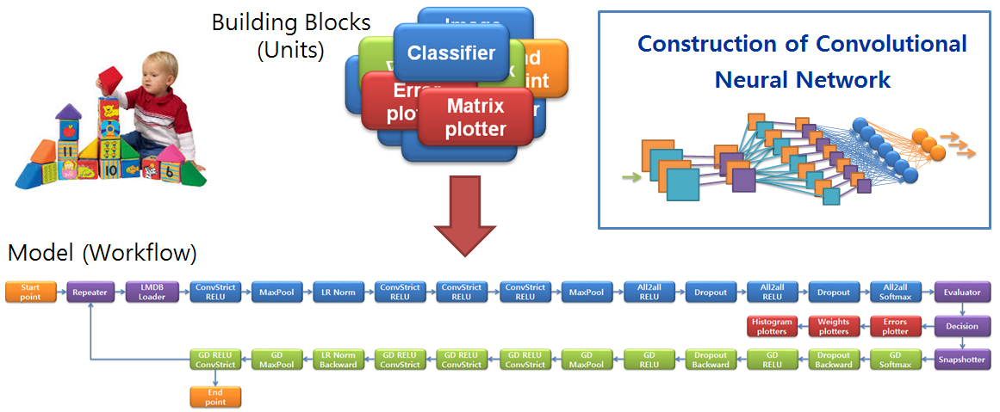

======
Basics
======

VELES uses modular paradigm for quick and easy development of Machine Learning
algorithms and models.

User can construct any dataflow algorithm including Neural Network models using
the predefined elementary building blocks - Units.

.. _two_ways_of_running_veles:

What is a Model?
::::::::::::::::

The Model or Workflow - a collection of Units connected to each other
implementing required algorithms. The class :class:`veles.workflow.Workflow`
is the container for the Model.

The Workflow can be very complex and can execute algorithms iteratively on the dataset.
In order to set start and end points in the algorithms the Workflow has a start
point and an end point (:class:`StartPoint <veles.workflow.StartPoint>`
and :class:`EndPoint <veles.workflow.EndPoint>`), so that when
:meth:`run() <veles.workflow.Workflow.run>` is called, the start point begins
the party and the end point's run ends the party, triggering
:meth:`on_workflow_finished() <veles.workflow.Workflow.on_workflow_finished>`.

Two ways of running Veles
:::::::::::::::::::::::::

You can start Veles by two methods:

    * ``python3 -m veles ...``
    * ``veles ...`` (**only** in case of :doc:`manualrst_veles_ubuntu_user_setup`)
    
Both methods execute :mod:`veles.__main__`, and they are absolutely equivalent.

.. include:: manualrst_veles_modes.rst
    
Master/slave
::::::::::::

.. image:: _static/master-slave.png

Master process does not do any calculation and just serves other actors.
It stores the current workflow state, including all units' data. Slave
processes maintain two channels of communication with master: plain TCP (commands,
discovery, etc.) and ZeroMQ (data). Initially, a new slave connect to a TCP socket
on master, registers itself and starts sending job requests. Master receives job
requests, generates jobs (serialized data from each unit in the workflow) and sends them
to corresponding slaves. The thing worth noting is that **workflows that exists
in master and slave are the same**, they are just operated in different modes.

Master runs the graphics server (see :doc:`manualrst_veles_graphics`), so that any
number of client can draw plots of what's going on. Besides, it sends periodic
status information to the web status server via HTTP and listens to commands on
the same raw TCP socket which is used for talking to slaves. The special communication protocol
is used based on JSON.

.. include:: manualrst_veles_units.rst
.. include:: manualrst_veles_distributed_units.rst