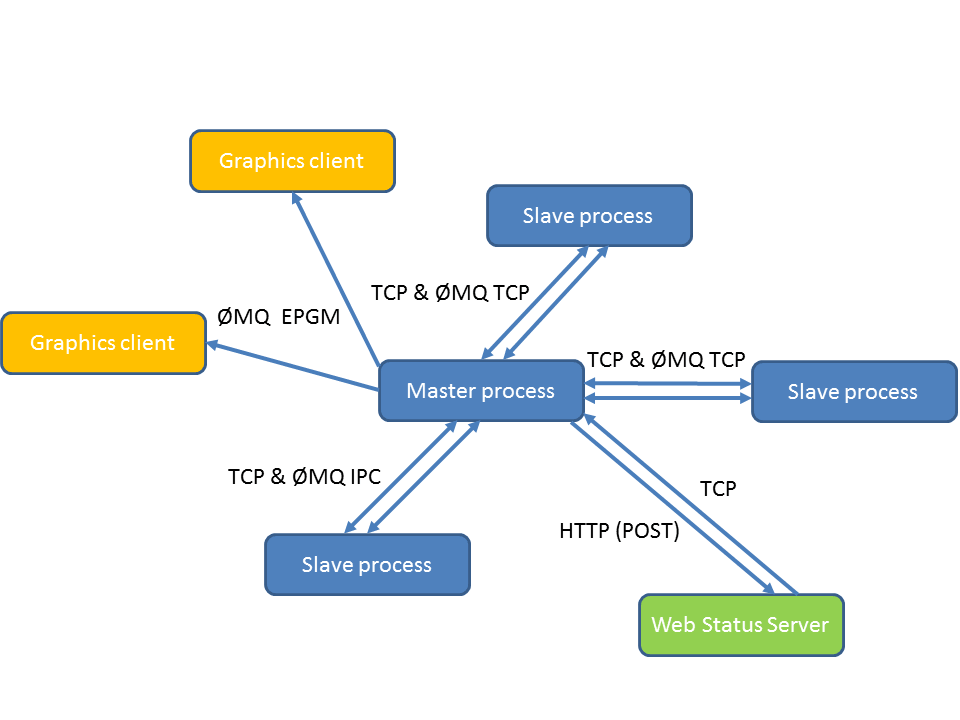

======
Basics
======

Workflow consists of units. That's it.

.. _two_ways_of_running_veles:

Three ways of running Veles
:::::::::::::::::::::::::::

You can run Veles in either of these two ways:

    * ``veles/scripts/velescli.py ...``
    * ``python3 -m veles ...``
    * ``veles ...`` (**only** in case of :doc:`manualrst_veles_ubuntu_user_setup`)
    
The second method executes :mod:`veles.__main__`, which in turn calls
``scripts/velescli.py``, and so basically does the third (it is an easy_install entry point)
so all these methods are totally equivalent.

Three execution modes
:::::::::::::::::::::

Veles model can run in three modes (actually, four, but the fourth is a
combination of the previous three):

    * Standalone (default)
    * Master (``-l/--listen-address``)
    * Slave (``-m/--master-address``)
    
Standalone mode is a single node workflow run, useful for debugging and simple
models which are not so computationally expensive. To understand the remaining two modes,
look at the scheme of how distributed Veles works:

Master process does not do any calculation and just serves other actors.
It stores the current workflow state, including all units' data. Slave
processes maintain two channels of communication with master: plain TCP (commands,
discovery, etc.) and ZeroMQ (data). Initially, a new slave connect to a TCP socket
on master, registers itself and starts sending job requests. Master receives job
requests, generates jobs (serialized data from each unit in the workflow) and sends them
to corresponding slaves. The thing worth noting is that **workflows that exists
in master and slave are the same**, they are just operated in different modes.

Master runs the graphics server (see :doc:`manualrst_veles_graphics`), so that any
number of client can draw plots of what's going on. Besides, it sends periodic
status information to the web status server via HTTP and listens to commands on
the same raw TCP socket which is used for talking to slaves. The special communication protocol
is used based on JSON.

.. include:: manualrst_veles_units.rst
.. include:: manualrst_veles_workflow.rst
.. include:: manualrst_veles_distributed_units.rst