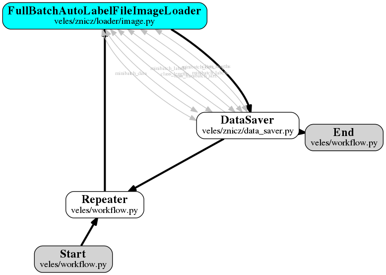
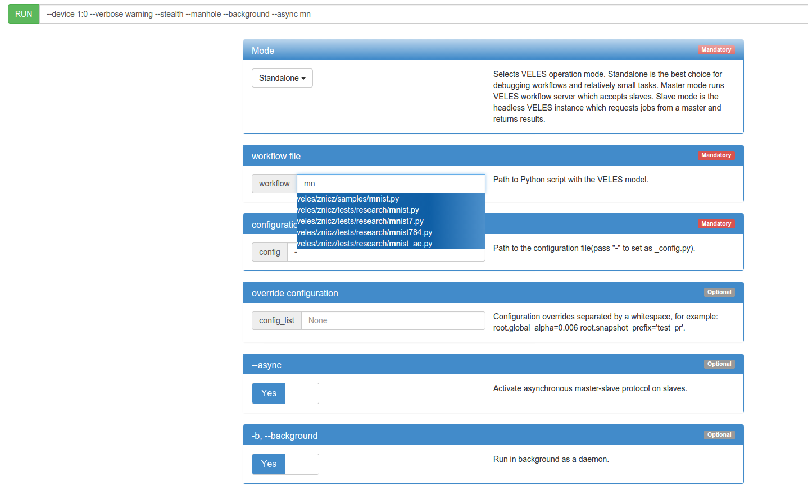
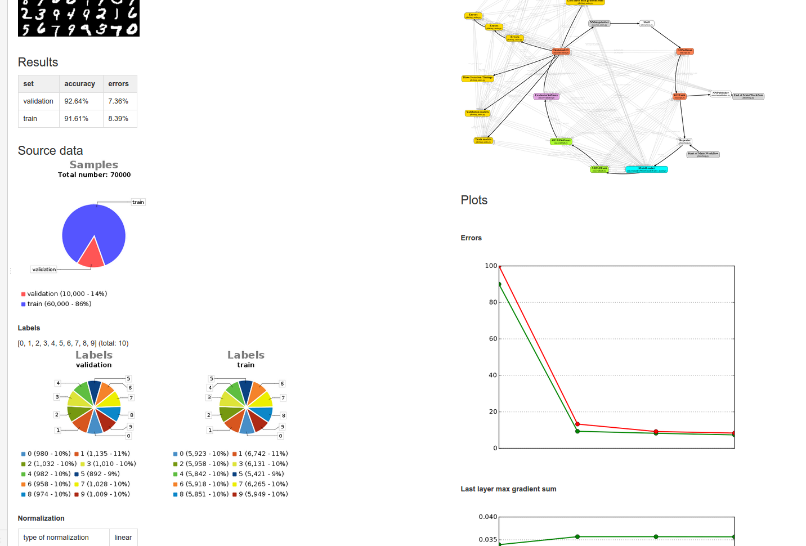

===============================
How to use Veles. MNIST example
===============================

:::::::::::::
Preprocessing
:::::::::::::

For preprocessing of the data you should use Loaders (descendants of
:class:`veles.loader.base.Loader`). To speed up the process of training, create
one Workflow for preprocessing and one Workflow for training. Preprocessing
workflow could look like this:

Here Loader preprocesses the data and DataSaver saves it. If speed is
not an issue, you can use preprocessing inside of training Workflow.

Available Loaders can be found in :doc:`manualrst_veles_units_kwargs`. Some of
Loaders could be used right away.
For other Loaders some functions have to be defined in descendant Class.

Sometimes existing Loaders are not suitable for the specific task. In such case
you should write custom Loader. For example, Loader for MNIST dataset
(:class:`veles.znicz.loader.loader_mnist.MnistLoader`) looks like this:

.. code-block:: python

    @implementer(IFullBatchLoader)
    class MnistLoader(FullBatchLoader):
        MAPPING = "mnist_loader"
        ...

        def __init__(self, workflow, **kwargs):
            super(MnistLoader, self).__init__(workflow, **kwargs)
            ...

        def load_dataset(self):
            """
            Loads dataset from internet
            """
            ...

        def load_original(self, offs, labels_count, labels_fnme, images_fnme):
            """Loads data from original MNIST files (idx1-ubyte and idx3-ubyte)
            """
            ...

        def load_data(self):
            """Here we will load MNIST data.
            """
            ...
            self.load_dataset()
            self.load_original(...)
            ...

Each Loader, which can be used without deriving from it, must have
MAPPING - unique loader's name.

There are few types of Loaders. If Loader was derived from
:class:`veles.loader.fullbatch.FullBatchLoader`, data will be stored
entire in memory. If Loader was derived from :class:`veles.loader.base.LoaderMSE`,
Loader has not only labels (string, int or double values),
but also targets (matrixes, vectors). If Loader was derived from
:class:`veles.loader.image.ImageLoader`, functionality for preprocessing images
could be used (scale, crop, add sobel, rotate, change color space, mirror, etc.)

Any descendants of :class:`veles.loader.fullbatch.FullBatchLoader` must implement
IFullBatchLoader interface :class:`veles.loader.fullbatch.IFullBatchLoader`:

.. code-block:: python

    class IFullBatchLoader(Interface):
        def load_data():
            """Load the data here.
            Must be set: class_lengths, original_data, [original_labels].
            """

In load_data() you should define:

  1. `class_lengths` (size of the train, validation and test samples),

  2. `original_data` (instance of :class:`veles.memory.Array` with array of data [test samples...validation samples...train samples]),

  3. `original_labels` (list of labels [test labels...validation labels...train labels]).
Lengths of `original_data` and `original_labels` must be equal.

If you have only data for train, you should use
:func:`veles.loader.fullbatch._resize_validation` to extract validation set from train set
(percentage of train set to validation is defined by `validation_ratio` parameter)

For any Loader normalization can be set. Available types of normalization can be
found in :doc:`manualrst_veles_workflow_parameters` in Data parameters.

Any Loader shuffles each train minibatch by default.
(to change it use `shuffle_limit`)

Loader prints simple statistics about data and compares the labels
distribution in train, validation and test sets.

::::::::
Training
::::::::

There are 4 ways to create train Workflow:

1. Use existing Snapshot of Workflow and continue training.
2. Use existing Workflow and existing Configuration file.
3. Use existing Workflow and change Configuration file.
4. Create custom Workflow and Configuration file.

+++++++++++++++++++++
Use existing Snapshot
+++++++++++++++++++++

Use your Snapshot to continue training if training was interrupted.

Or download existing Snapshot from Amazon (paths to snapshots
of the Model is in "snapshots" field in manifest.json)

Here is manifest.json of MNIST:

.. code-block:: python

    {
    ...
    "snapshots":
    ["https://s3-eu-west-1.amazonaws.com/veles.forge/MNIST/mnist_validation_1.92_train_0.04.4.pickle.gz",
    "https://s3-eu-west-1.amazonaws.com/veles.forge/MNIST/mnist_caffe_validation_0.86_train_0.23.4.pickle",
    "https://s3-eu-west-1.amazonaws.com/veles.forge/MNIST/mnist_conv_validation_0.73_train_0.11.4.pickle"]
    }

Or use path to the amazon snapshot as command line argument. For fully-connected MNISTWorkflow::

    python3 -m veles -s -d 0 -w=https://s3-eu-west-1.amazonaws.com/veles.forge/MNIST/mnist_validation_1.92_train_0.04.4.pickle.gz veles/znicz/samples/MNIST/mnist.py -

For convolutional MNISTWorkflow::

    python3 -m veles -s -d 0 -w=https://s3-eu-west-1.amazonaws.com/veles.forge/MNIST/mnist_conv_validation_0.73_train_0.11.4.pickle veles/znicz/samples/MNIST/mnist.py veles/znicz/samples/MNIST/mnist_conv_config.py

+++++++++++++++++++++++++++++++++++++++++++++++++++++
Use existing Workflow and existing Configuration file
+++++++++++++++++++++++++++++++++++++++++++++++++++++

Use existing Workflows from samples or download them from VelesForge.

To run veles from command line you need to set path to workflow and path to
configuration files as arguments::

    python3 -m veles path_to_workflow path_to_config

See :doc:`manualrst_veles_cml_examples` for command line examples.
To run the MNIST workflow from command line for fully-connected Workflow::

    python3 -m veles -s -d 0 veles/znicz/samples/MNIST/mnist.py -

For convolutional Workflow::

    python3 -m veles -s -d 0 veles/znicz/samples/MNIST/mnist.py veles/znicz/samples/MNIST/mnist_conv_config.py

For convolutional Workflow with Caffe configuration::

    python3 -m veles -s -d 0 veles/znicz/samples/MNIST/mnist.py veles/znicz/samples/MNIST/mnist_caffe_config.py

If Veles was installed for 1-2 users levels, set
PYTHONPATH="/usr/lib/python3/dist-packages" or use absolute paths to the Workflow
and Configuration files::

    python3 -m veles -s -d 0 /usr/lib/python3/dist-packages/veles/znicz/samples/MNIST/mnist.py -

Or copy samples from /usr/lib/python3/dist-packages/veles/znicz/samples to your local directory.

+++++++++++++++++++++++++++++++++++++++++++++++++++
Use existing Workflow and change Configuration file
+++++++++++++++++++++++++++++++++++++++++++++++++++

About configuration: :doc:`manualrst_veles_configuration`

First copy samples to a local directory::

    cp -r /usr/lib/python3/dist-packages/veles/znicz/samples /home/user/

or download Model from VelesForge.

There 2 ways to change configuration parameters:

1. In configuration file
2. From command line

To use the first way, open file /home/user/samples/MNIST/mnist_config.py and change it.
To use the second way change necessary parameters right from the command line::

    python3 -m veles -s -d 0 /usr/lib/python3/dist-packages/veles/znicz/samples/MNIST/mnist.py - root.mnistr.loader.minibatch_size=10 root.mnistr.loader.data_path=\"/path/to/new/dataset\"

MNIST workflow (:class:`veles.znicz.samples.mnist.MnistWorkflow`) was derived
from StandardWorkflow (:class:`veles.znicz.standard_workflow.StandardWorkflow`).

See parameters of StandardWorkflow and how to work with it here: :doc:`manualrst_veles_workflow_parameters`

To change the loss function from Softmax to MSE, change `loss_function` parameter.
Don't forget to change the last layer in `layers` from "softmax" type to "all2all" type.

.. code-block:: python

    ...
    root.mnistr.update({
        ...
        "loss_function": "mse", # use to be softmax
        ...
        "layers": [{...},
                   {"name": "fc_softmax2",
                    "type": "all2all", # use to be softmax
                    "->": {...},
                    "<-": {...}}]})

.. note:: Name of layer in `layers` parameter does not define the  type of layer.
   Layer could have any name or could do not have names at all.

To customize loader change `loader_name` parameter. Make sure, that your
`loader_name` exists in MAPPING of some Loader and this Loader was imported
somewhere.

.. code-block:: python

    class MyLoader(SomeLoader):
        MAPPING = "my_loader"
        ...

.. code-block:: python

    from veles.znicz.loader.my_loader import MyLoader

    ...
    root.mnistr.update({
        ...
        "loader_name": "my_loader", # use to be mnist_loader
        ...})

To change parameters of preprocessing or loading data use `loader` parameters

.. code-block:: python

    ...
    root.mnistr.update({
        ...
        "loader": {"minibatch_size": Range(20, 1, 1000), # use to be Range(60, 1, 1000)
                   "force_numpy": False,
                   "normalization_type": "linear",
                   "data_path": "/path/to/new/dataset"}, # use to be os.path.join(root.common.dirs.datasets, "MNIST")
        ...})

If your Workflow fails to run because Loader was not initialized and some path
to data does not exist, make sure that the dataset was downloaded (by Downloader
unit :class:`veles.downloader.Downloader` or manually), path to data exists and
has correct permissions. Change data_path in `loader.data_path` if it is necessary.

To optimize parameters of Workflow by Genetic Algorithm use Range (:class:`veles.genetics.config.Range`)
for every parameter, which you want to optimize. When optimization is off, the first
parameter will be used by default. In MNIST example minibatch size will be equal 20.
If optimization is on, the second and the third parameter will be used as range to optimize.
In MNIST example minibatch size will be selected from 1 to 1000 by Genetic Algorithm.

To change stop conditions of running process, use `decision` parameters.

.. code-block:: python

    ...
    root.mnistr.update({
        ...
        "decision": {"fail_iterations": 50,
                     "max_epochs": 1000000000},
        ...})

`fail iterations` parameter determines how many epochs without improvement in
validation accuracy should pass before training will be stopped

`max_epochs` parameter defines how many epochs should pass before training will be stopped

To change the topology of Neural Network, use `layers` parameter.
Learn more: :doc:`manualrst_veles_workflow_parameters`

.. code-block:: python

    ...
    root.mnistr.update({
        ...
        "layers": [{"name": "fc_tanh1",
                    "type": "all2all_tanh",
                    "->": {"learning_rate": 0.1,
                           ...},
                    "<-": {...}},
                   {"name": "fc_softmax2",
                    "type": "softmax",
                    "->": {...},
                    "<-": {...}}]})

`layers` parameter is a list of layers. The order of the list determines the order of layers.
Each layer has a `type`, which defines unit's Class. `name` is an optional parameter.
`"->"` defines forward propagation parameters. `"<-"` defines backward propagation parameters.

Other configuration parameters: for Snapshotter (descendants of :class:`veles.snapshotter.SnapshotterBase`)
use `snapshotter`, for LearningRateAdjuster (:class:`veles.znicz.lr_adjust.LearningRateAdjust`)
use `lr_adjuster`, for WeightsPlotter (:class:`veles.znicz.nn_plotting_units.Weights2D`)
use `weights_plotter`.

The above mentioned is valid only for StandardWorkflow
(:class:`veles.znicz.standard_workflow.StandardWorkflow`)

+++++++++++++++++++++++++++++++++++++++++++++
Create custom Workflow and Configuration file
+++++++++++++++++++++++++++++++++++++++++++++

To create a Workflow see :doc:`manualrst_veles_workflow_creation`

.. code-block:: python

    ...
    class MnistWorkflow(StandardWorkflow):
        def __init__(self, workflow, **kwargs):
            super(MnistWorkflow, self).__init__(workflow, **kwargs)
            ...

        def link_mnist_weights_plotter(self, layers, limit, weights_input, parent):
            ...

        def create_workflow(self):
            ...

        def on_workflow_finished(self):
            ...

    def run(load, main):
        load(MnistWorkflow,
             ...)
        main()

:::::::
Testing
:::::::

Snapshot of trained Workflow is required to run Workflow in testing mode.
There are 5 ways to create test Workflow:

1. Use existing test Workflow or script
2. Use --test and --result-file arguments in command line
3. Use testing mode and write_results function
4. Create Workflow with extract_forward function
5. Create custom test Workflow

++++++++++++++++++++++++++++++++++++
Use existing test Workflow or script
++++++++++++++++++++++++++++++++++++

If test Workflow is exists it is located in the directory with
train Workflow. See samples or download Model from VelesForge.

++++++++++++++++++++++++++++++++++++++++++++++++++++++
Use --test and --result-file arguments in command line
++++++++++++++++++++++++++++++++++++++++++++++++++++++

If Loader of trained Workflow has filled test set, run
Workflow in testing mode with --test command line argument.
Use --result-file argument to save the results of testing::

    python3 -m veles -s -d 0 --test --result-file="/home/user/mnist_result.txt" /home/user/samples/MNIST/mnist.py -

File with results will be constructed from results of
``get_metric_values`` and ``get_metric_names`` functions of Units
(IResultProvider must be implemented). Example:

.. code-block:: python

    @implementer(IResultProvider, ...)
    class EvaluatorBase(...):
        ...
        def get_metric_names(self):
            ...

        def get_metric_values(self):
            ...

+++++++++++++++++++++++++++++++++++++++++++
Use testing mode and write_results function
+++++++++++++++++++++++++++++++++++++++++++

If Loader does not contain preferable test data, change data in Loader or relink
Loader after loading Workflow from the snapshot. Take a look at the MNIST example
(:mod:`veles.znicz.samples.MNIST.mnist_forward.py`).

First, load Workflow from snapshot:

.. code-block:: python

    kwargs = {
        "dry_run": "init",
        "snapshot":
        "https://s3-eu-west-1.amazonaws.com/veles.forge/MNIST/mnist_conv_"
        "validation_0.78_train_0.16.4.pickle"}
    path_to_model = "veles/znicz/samples/MNIST/mnist.py"

    launcher = veles(path_to_model, **kwargs)  # pylint: disable=E1102

The code above runs Veles inside of python/ipython script and it is equivalent to
the execution of the following command from the command line::

    python3 -m veles --dry-run init --snapshot=https://s3-eu-west-1.amazonaws.com/veles.forge/MNIST/mnist_conv_validation_0.78_train_0.16.4.pickle path_to_model -

Next, switch to the testing mode:

.. code-block:: python

    launcher.testing = True

The testing mode is switched on by --test argument in the command line

Replace Loader with another one by :func:`veles.workflow.change_unit()`:

.. code-block:: python

    ...
    new_loader = launcher.workflow.change_unit(
        workflow.loader.name,
        FileListImageLoader(workflow, **loader_config))
    ...

Set labels_mapping and class_keys in Evaluator for correct writing the results:

.. code-block:: python

    ...
    launcher.workflow.evaluator.labels_mapping = labels_mapping
    launcher.workflow.evaluator.class_keys = new_loader.class_keys
    ...

Initialize and run relinked Workflow:

.. code-block:: python

    launcher.boot()

Write results with :func:`veles.workflow.write_results`:

.. code-block:: python

    launcher.workflow.write_results(file=os.path.join(data_path, "result.txt"))

:func:`veles.workflow.write_results` is used by --result-file argument in the command line

+++++++++++++++++++++++++++++++++++++++++++++
Create Workflow with extract_forward function
+++++++++++++++++++++++++++++++++++++++++++++

If the workflow was derived by StandardWorkflow (:class:`veles.znicz.standard_workflow.StandardWorkflow`),
you can use :func:`veles.znicz.standard_workflow.extract_forward_workflow`

First, load Workflow from snapshot:

.. code-block:: python

    kwargs = {
        "dry_run": "init",
        "snapshot":
        "https://s3-eu-west-1.amazonaws.com/veles.forge/MNIST/mnist_conv_"
        "validation_0.78_train_0.16.4.pickle"}
    path_to_model = "veles/znicz/samples/MNIST/mnist.py"

    launcher = veles(path_to_model, **kwargs)  # pylint: disable=E1102

Next, switch to the testing mode:

.. code-block:: python

    launcher.testing = True

Use :func:`veles.znicz.standard_workflow.extract_forward_workflow` to create testing Workflow:

.. code-block:: python

    fwd = launcher.workflow.extract_forward_workflow(
        loader_name="file_list_image",
        loader_config={"minibatch_size": 1, "scale": (28, 28), "shuffle_limit": 0,
                       "background_color": (0,), "color_space": "GRAY",
                       "normalization_type": "linear",
                       "path_to_folder": os.path.join(data_path, "mnist_test"),
                       "path_to_test_text_file":
                       [os.path.join(data_dir, "mnist_test.txt")]},
        result_unit_factory=ResultWriter,
        result_unit_config={"output_path": os.path.join(data_dir, "result.txt")},
        cyclic=True)

Use custom ResultWriter Unit to save the results of testing. Link attributes:

.. code-block:: python

    fwd.result_unit.link_attrs(fwd.loader, "minibatch_size")
    fwd.result_unit.link_attrs(
        fwd.loader, ("input_path", "path_to_test_text_file"))
    fwd.result_unit.reversed_labels_mapping = reversed_labels_mapping

Initialize and run relinked Workflow:

.. code-block:: python

    launcher.boot()

+++++++++++++++++++++++++++
Create custom test Workflow
+++++++++++++++++++++++++++

To create custom test Workflow load Workflow from snapshot with one of two ways.

1. Run veles inside of the script:

.. code-block:: python

    kwargs = {
        "dry_run": "init",
        "snapshot":
        "https://s3-eu-west-1.amazonaws.com/veles.forge/MNIST/mnist_conv_"
        "validation_0.78_train_0.16.4.pickle"}
    path_to_model = "veles/znicz/samples/MNIST/mnist.py"

    launcher = veles(path_to_model, **kwargs)  # pylint: disable=E1102
    workflow = launcher.workflow

2. Load workflow with :func:`veles.snapshotter.SnapshotterToFile.import_`

.. code-block:: python

    snapshot_name = "https://s3-eu-west-1.amazonaws.com/veles.forge/MNIST/mnist_conv_validation_0.78_train_0.16.4.pickle"
    workflow = SnapshotterToFile.import_(snapshot_name)

Relink Workflow as you want and run it. For example, you can delete backward
propagation units. Or link :class:`veles.plumbing.EndPoint` right after
forward propagation units:

.. code-block:: python

    workflow.stopped = False

    for fwd in workflow.forwards:
        fwd.gate_block <<= False

    workflow.forwards[0].ignores_gate <<= True

    workflow.end_point.unlink_before()
    last_fwd = workflow.forwards[-1]
    for ref_dst in last_fwd.links_to.keys():
        ref_dst().gate_block = Bool(True)
    workflow.end_point.link_from(last_fwd)

::::::::::
How to run
::::::::::

+++++++++++++++++++++++++
Run with ipython notebook
+++++++++++++++++++++++++

Veles is usable from IPython or IPython Notebook.
Open ipython notebook, import veles and run it:

.. code-block:: python

    import veles
    launcher = veles(
        "veles/znicz/samples/MnistSimple/mnist.py", stealth=True,
        matplotlib_backend="WebAgg")

Arguments are the same as for the command line, but "-" symbol changes to "_" symbol
and using of long form options is required.

To pause the process of execution:

.. code-block:: python

    launcher.pause()

To resume the process of execution:

.. code-block:: python

    launcher.resume()

To stop the process of execution:

.. code-block:: python

    launcher.stop()

To initialize the Workflow:

.. code-block:: python

    launcher.initialize()

To run the Workflow:

.. code-block:: python

    launcher.run()

To initialize and run the Workflow:

.. code-block:: python

    launcher.boot()

To get the Workflow:

.. code-block:: python

    launcher.workflow

To get Units:

.. code-block:: python

    launcher.workflow.units

To get specific Unit:

1. Get by name:

.. code-block:: python

    loader = launcher.workflow["MnistLoader"]

2. Get by the instance of Unit:

.. code-block:: python

    loader = launcher.workflow.loader

3. Get from Units list

.. code-block:: python

    launcher.workflow.units

[veles.plumbing.StartPoint "Start of MnistWorkflow",
veles.plumbing.EndPoint "End of MnistWorkflow",
<veles.plumbing.Repeater object at 0x7f8fc4f1def0>,
<MnistSimple.loader_mnist.MnistLoader object at 0x7f8ff17c20f0>,
...]

.. code-block:: python

    loader = launcher.workflow.units[3]

+++++++++++++++++++++
Run from command line
+++++++++++++++++++++

See :doc:`manualrst_veles_cml_examples`.

+++++++++++++++
Frontend option
+++++++++++++++

Use ``frontend`` option for the interactive display of Veles options and the command line.
Run in the terminal::

    python3 -m veles --frontend

Compose the command line and click run button.

++++++++++++++
Manhole option
++++++++++++++

Use manhole option to run interactive mode at any time. Run::

    python3 -m veles --manhole /home/user/samples/MNIST/mnist.py -

You will see something like this::

    MANHOLE:Manhole UDS path: nc -U /tmp/manhole-7355
    MANHOLE:Waiting for a new connection (in pid 7355) ...

To switch to the interactive console open new terminal and run the command with a Manhole UDS path::

    nc -U /tmp/manhole-7355

You will see::

    VELES interactive console
    Type in 'workflow' or 'units' to start
    veles [1]>

Change some attributes. For example, decrease learning rate in backward propagation units (gds) in 10 times::

    veles [1]> for gd in workflow.gds:
          ...:     gd.learning_rate/=10
          ...:

    veles [2]>

To stop interactive mode and continue execution type "exit()"::

    veles [2]> exit()

++++++++++++++++++++
Distributed training
++++++++++++++++++++

See :doc:`manualrst_veles_cml_examples`.

++++++++++++++++++
Training ensembles
++++++++++++++++++

See :doc:`manualrst_veles_ensembles`.

:::::::::::::::::::::::
Optimization parameters
:::::::::::::::::::::::

.. code-block:: python

    from veles.config import root
    from veles.genetics import Range

    root.mnistr.update({
        ...
        "loader": {"minibatch_size": Range(20, 1, 1000),
                   "normalization_type": "linear",
                   "data_path": "/path/to/dataset"},
        ...})

To optimize parameters of Workflow by Genetic Algorithm use Range
(veles.genetics.config.Range) for every parameter, which you want to optimize.
When optimization is off, the first parameter will be used by default. In MNIST
example minibatch size will be equal 20. If optimization is on, the second and
the third parameter will be used as range to optimize. In MNIST example
minibatch size will be selected from 1 to 1000 by Genetic Algorithm.

See :doc:`manualrst_veles_genetic_optimization`.

:::::::::::::::::::
Export of the Model
:::::::::::::::::::

To export Model as package use :func:`veles.workflow.package_export`.
Set path to the exported package by `package_name` argument. `precision` is an optional parameter.

.. code-block:: python

    ...
    class MnistWorkflow(StandardWorkflow):
        def __init__(self, workflow, **kwargs):
            super(MnistWorkflow, self).__init__(workflow, **kwargs)
            self.export_wf = kwargs.get("export_wf", False)
            self.package_name = kwargs.get(
                "package_name", os.path.join(root.common.dirs.user, "mnist.zip"))

        ...

        def on_workflow_finished(self):
            super(MnistWorkflow, self).on_workflow_finished()
            if self.export_wf:
                self.package_export(self.package_name, precision=16)

    def run(load, main):
        load(MnistWorkflow,
             ...)
        main()

::::::::::::::
Using plotters
::::::::::::::

To disable plotters during Workflow run::

    python3 -m veles -p '' /home/user/samples/MNIST/mnist.py -

To choose WebAgg backend::

    python3 -m veles -p 'WebAgg' /home/user/samples/MNIST/mnist.py -

To choose Qt4Agg backend::

    python3 -m veles -p 'Qt4Agg' /home/user/samples/MNIST/mnist.py -

To disable plotting service::

    python3 -m veles /home/user/samples/MNIST/mnist.py - root.common.disable.plotting=True

:::::::::::::::
Using publisher
:::::::::::::::

See :doc:`manualrst_veles_publishing`.

