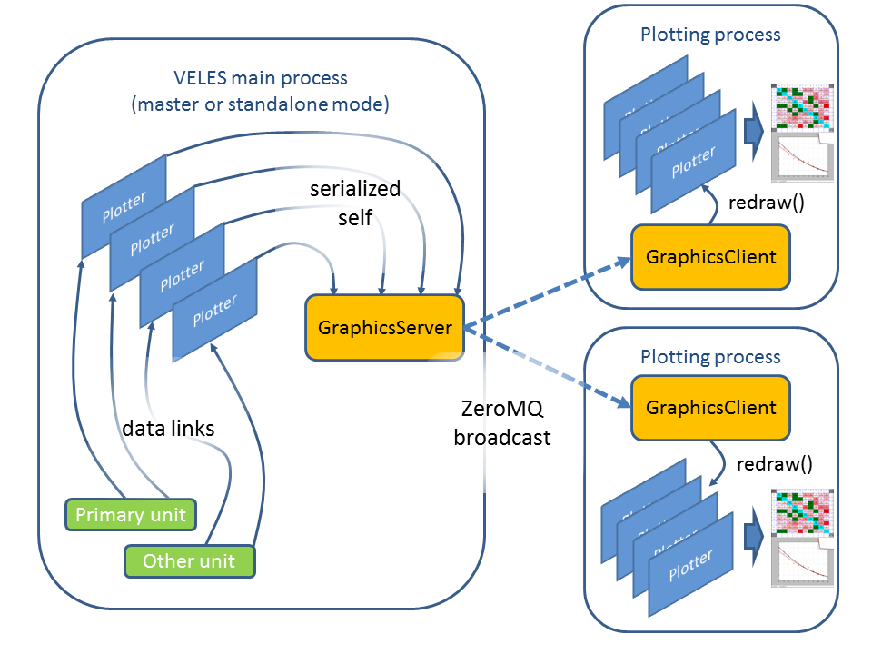

=====================
Graphics and plotting
=====================

Every workflow can have one or more special units, which do not influence
control flow but demonstrate other units' internal state. such units are called "plotters" and
should inherit from :class:`Plotter <veles.plotter.Plotter>`. Normally, they
use Matplotlib to draw plots, images and graphs and always work in a separate
process, probably on remote machine, called "graphics client".

Here is the diagram showing how plotters work:

Each plotter does initial data processing, taking only needed data from linked properties.
Then it is :func:`pickle.dumps()`-ed and sent over the network through ZeroMQ EPGM endpoint.
It means that there can be any number of clients receiving and drawing plots on
different machines. The work is done by :class:`GraphicsServer <veles.graphics_server.GraphicsServer>` class.
The graphics client listens to broadcast messages in :class:`GraphicsClient <veles.graphics_client.GraphicsClient>`,
deserializing received units and calling :meth:`redraw()` on each. Thanks to the way
Matplotlib plotting works, units do not need to recreate everything from scratch,
though they should be ready to.

Normally, one graphics client instance is launched during VELEs startup,
but can be disabled with ``--no-graphics-client``. To launch a graphics client manually,
execute::

    python3 veles/graphics_client.py -e <endpoint>
    
where <endpoint> is the broadcast ZeroMQ address, printed in startup logs or viewable 
through the web status page.

You may specify WebAgg Matplotlib backend (``-b`` option here, or ``-p`` in velescli.py),
so that plots will be accessible through the local network or the internet.

There is a feature to write each plot into a PDF file. To activate PDf mode,
send USR2 signal to ``graphics_client.py`` process, something like::

    killall -SIGUSR2 python3

