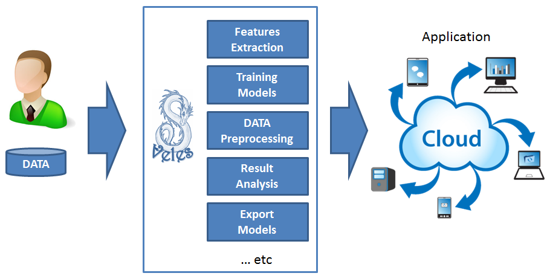

============
Introduction
============

VELES is a distributed platform, which provides machine learning and
data processing services for a user. It is written in Python.

At first, check :doc:`manualrst_veles_system_requirements`.

People who work with VELES divided into three groups, or levels: 1
(casual user - Entry), 2 (models constructor - Medium) and 3 (unit developer - High).
The first level users are supposed just to change model settings and do not
write any code, whereas second level users may write custom models and third
level users additionally write new units.

For Ubuntu:

:doc:`manualrst_veles_ubuntu_user_setup`

:doc:`manualrst_veles_developer_setup`

For Cluster deployers and other GNU/Linux:

:doc:`manualrst_veles_user_setup`

Here is introduction video "Veles in 2013":

.. raw:: html

        <video width="640" height="390" controls>
            <source src="_static/video.mp4" type="video/mp4">
        </video>

Currently Veles has ~225 units (elementary building blocks)