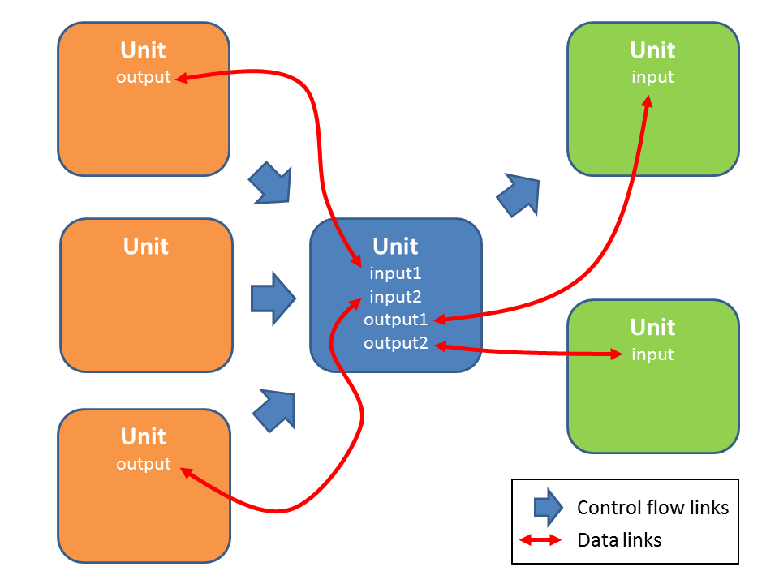
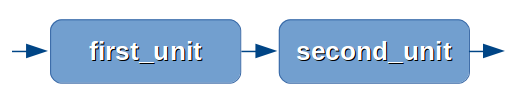
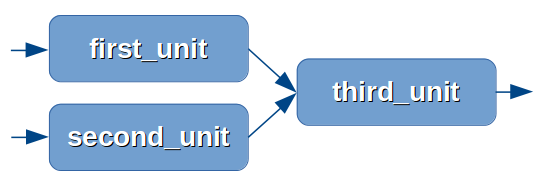
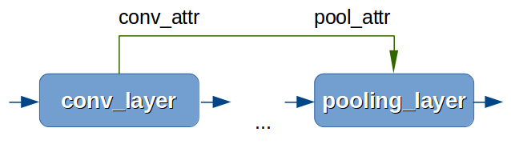

:orphan:

Units
:::::

*Unit* is a core concept of VELES. Technically, it is class inherited from :class:`Unit <veles.units.Unit>`
and satisfying :class:`IUnit <veles.units.IUnit>` interface.

A unit carries some algorithm which is solid and indivisible - it is a *building block*. For example, it is
a single layer of a neural network or a rhythm extraction from music data. A unit
can be *constructed*, *initialized* and *run*. When a unit is constructed, it 
creates it's *output* data fields. During the initialization, *input* data fields
are validated and some preparation is done for running. Unit's run is a reentrant
application of the underlying algorithm, which processes inputs and updates outputs.
Units connect with each other in two ways: control flow links and data links.

The blue unit will not run unless all the three orange predecessors finish to run.
This is a *control flow*. The blue unit takes inputs from orange units' outputs.
This makes units' running *data driven*.

Units may unite into a :class:`Workflow <veles.workflow.Workflow>`. Actually, each unit
has a :attr:`workflow` property which points to the parent object. Workflows are
units, too, so they can also be linked and run, but in a slightly different way.
See :doc:`manualrst_veles_workflow_creation`.

Distributed calculation is performed using the additional group of methods required
by :class:`IDistributable <veles.distributable.IDistributable>` (see :doc:`manualrst_veles_distributed_units`).

------------------
How to link Units?
------------------

There are two types of connections in workflow: Control and Data.

Control flow connections
~~~~~~~~~~~~~~~~~~~~~~~~
Control flow connections defines execution order of units in the workflow.

Each unit can be linked with multiple number of units. In order to make this
method atomic, the reverse (``link_from``) linkage order was implemented in
contorary to ``link_to``.
The method :py:meth:`veles.units.Unit.link_from` set execution order of current
unit instance after the execution of units given as argument (any itteratable).

.. code-block:: python

   second_unit.link_from(first_unit)

.. code-block:: python

   third_unit.link_from([first_unit, second_init])

To remove control flow link use :py:meth:`veles.units.Unit.unlink_from` and
:py:meth:`veles.units.Unit.unlink_all`

Data flow connections
~~~~~~~~~~~~~~~~~~~~~
Data flow connections defines data propagation from unit to unit.

The content of the attribute of one unit can be assigned (linked) to attribute
of another unit using :meth:`veles.units.Unit.link_attrs` method.

For example, if you want to pass convolutional layer attribute named
`conv_attr` to pooling layer attribute named `pool_attr`:

.. code-block:: python

   pooling_layer.link_attrs(conv_layer, ("pool_attr", "conv_attr"))

The same effect can be achieved by using assignement operator ``=``. But if assing
attribute holding immutable or simple object like integer it must be
marked using :class:`veles.mutable.LinkableAttribute` at any place in the program
before this point.

.. code-block:: python

  pooling_layer.pool_attr = conv_layer.conv_attr

If attributes have a one name, attributes can be written as one string:

.. code-block:: python

  pooling_layer.link_attr(conv_layer, "some_attr")

It is equivalent to this:

.. code-block:: python

  pooling_layer.link_attr(conv_layer, ("some_attr", "some_attr"))

And this:

.. code-block:: python

  pooling_layer.some_attr = conv_layer.some_attr

.. image:: _static/linking_data2.png

Some text about iterable argument:

.. code-block:: python

  pooling_layer.link_attr(conv_layer, ("pool_attr", "conv_attr"), "some_attr")

The passing data will be **shared** between those units.

-------------
Service units
-------------

* `Loaders` load raw images, pre-process them and make the initial data vectors.
* `Repeater` is a dummy unit that should be linked from `start_point` and from the last unit of the Workflow.
* `Snapshotter` makes `pickle` snapshots from the `Workflow` each epoch.
* `Plotters` are used to draw plots: weight matrices, error for epochs, etc.

More units: :doc:`manualrst_veles_units_kwargs`.