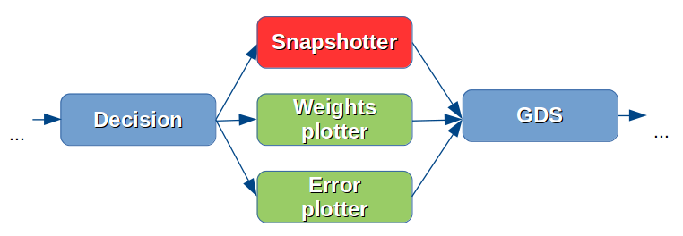
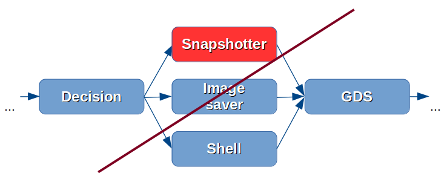
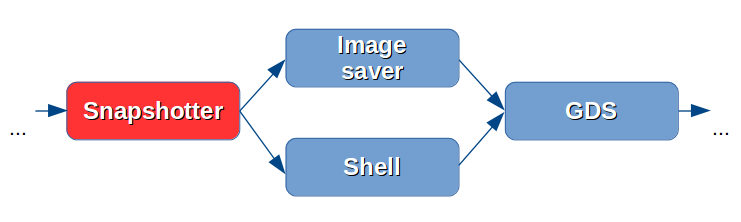
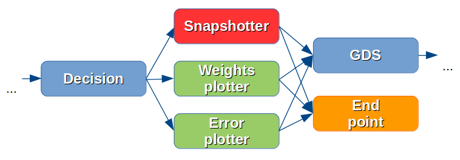

==========================================================
How to create the Workflow. From beginner to professional.
==========================================================

How to create Workflow with StandardWorkflow help
:::::::::::::::::::::::::::::::::::::::::::::::::

Classes :class:`veles.znicz.standard_workflow.StandardWorkflow` and
:class:`veles.znicz.standard_workflow.StandardWorkflowBase` are auxiliary
classes for easy creation of Fully Connected or Convolutional Models.

The biggest problem for the beginner is the absence of knowledge about Units,
their parameters, properties and linking abilities. The class :class:`veles.znicz.standard_workflow.StandardWorkflow`
is designed to help users by automating the process of Units integration.

Using StandardWorkflow. Setting parameters.
-------------------------------------------

The simplest way to create a Model (:doc:`manualrst_veles_basics`) which
implements an algorithm (:doc:`manualrst_veles_algorithms`) is to use
:class:`veles.znicz.standard_workflow.StandardWorkflow`. Create the file
named "my_worflow.py" and import :class:`veles.znicz.standard_workflow.StandardWorkflow`:

.. code-block:: python

   from veles.znicz.standard_workflow import StandardWorkflow

First, create :func:`run` function with :func:`load` and
:func:`main` methods. It is mandatory for each workflow file. :func:`load`
creates the instance of the specified workflow type and returns tuple
(workflow, snapshot). :func:`main` initializes and runs it.

.. code-block:: python

   def run(load, main)
       load(StandardWorkflow)
       main()

Second, set workflow parameters.
For the StandardWorkflow obligatory parameters are: ``layers`` or ``mcdnnic_topology``,
``loader_name`` and ``loader_config``. ``layers`` or ``mcdnnic_topology``
defines structure of Model. ``mcdnnic_topology`` is a way to set topology like
in artical http://papers.nips.cc/paper/4824-imagenet-classification-with-deep-convolutional-neural-networks.
``layers`` is a list of dictionary with layers of Model. ``layers`` also
defines parameters for each layer. To set parameters for ``mcdnnic_topology``,
use ``mcdnnic_parameters`` (see :mod:`veles.znicz.samples.lines` and :mod:`veles.znicz.samples.lines_config`).
``loader_name`` defines the name of Loader, which will be used to read the data.
``loader_config`` defines loader parameters. To set parameters, add them
in :func:`load` function

.. code-block:: python

   def run(load, main)
       load(StandardWorkflow,
            loader_name="lmdb",
            loader_config={"train_path": "Desktop/ilsvrc12_train_lmdb"},
            layers=[{"type": "all2all_tanh"}, {"type": "softmax"}])
       main()

See supported parameters with descriptions and default
values in :doc:`manualrst_veles_workflow_parameters`.

Alternatively, it is possible to pass parameters using :class:`veles.config.Config` (see
:doc:`manualrst_veles_using_configs`) like in the example below.

.. code-block:: python

  from veles.config import root
  from veles.znicz.standard_workflow import StandardWorkflow

  def run(load, main)
      load(StandardWorkflow,
           loader_name=root.my_workflow.loader_name,
           loader_config=root.my_workflow.loader,
           layers=root.my_workflow.layers)
      main()

For that define the parameters in my_workflow_config.py file.

.. code-block:: python

  from veles.config import root

  root.my_workflow.update({
      "loader_name": "lmdb",
      "loader": {"train_path": "Desktop/ilsvrc12_train_lmdb"},
      "layers": [{"type": "all2all_tanh"}, {"type": "softmax"}]})

The workflow and the configuration file are ready to use.

.. note:: The parameters of the workflow (the regardless method used to set them)
   shall exactly match the parameters defined in the related class instance to which they
   are assigned. (in our example :class:`veles.znicz.loader.loader_lmdb.LMDBLoader`)
   If wrong parameters are assigned to the Class instance, Veles will generate a
   warning or error.

Overriding :func:`create_workflow()` in subclass of StandardWorkflow.
---------------------------------------------------------------------

If, for some reason, you are not satisfied with the topology created by StandardWorkflow
based on configuration parameters, the method
:func:`veles.znicz.standard_workflow.StandardWorkflow.create_workflow()`
can be overridden to link Units in different order.

The default implementation of
:func:`veles.znicz.standard_workflow.StandardWorkflow.create_workflow()` in
:class:`veles.znicz.standard_workflow.StandardWorkflow` is presented below.

.. code-block:: python

  def create_workflow(self):
      # Add repeater unit
      self.link_repeater(self.start_point)

      # Add loader unit
      self.link_loader(self.repeater)

      # Add forwards units
      self.link_forwards(("input", "minibatch_data"), self.loader)

      # Add evaluator unit
      self.link_evaluator(self.forwards[-1])

      # Add decision unit
      self.link_decision(self.evaluator)

      # Add snapshotter unit
      self.link_snapshotter(self.decision)

      # Add gradient descent units
      self.link_gds(self.snapshotter)

      # Loop workflow
      self.link_loop(self.gds[0])

      # Add end_point unit
      self.link_end_point(self.snapshotter)

.. image:: _static/standard_workflow_create_workflow.png

The method :func:`veles.znicz.standard_workflow.StandardWorkflow.create_workflow()`
consists of `link functions` calls, which
links each unit with the previous one (the is an architectural and logical reason
to link current unit with the previous one which explaned later). Previous unit
(unit to link with) is passed as `link function` argument.
Here is an example of `link function`, which links
:class:`veles.znicz.mean_disp_normalizer.MeanDispNormalizer` unit.

.. code-block:: python

  def link_meandispnorm(self, *parents):
      # creating instance of unit
      self.meandispnorm = MeanDispNormalizer(self)

      # linking attributes
      self.meandispnorm.link_attrs(self.loader,
                                   ("input", "minibatch_data"),
                                   "mean", "rdisp")
      # linking by control flow
      self.meandispnorm.link_from(*parents)

      # return instance
      return self.meandispnorm

.. image:: _static/standard_workflow_meandispnorm.png

`link function` creates an instance of the unit ('MeanDispNormalizer'), link some
attributes to other existing in workflow units (in this case, loader's, because
MeanDispNormalizer designed to work with 'Loader') and links the control flow order ('link_from').
`link function` returns the instance of the freshly created and linked unit.

Read more about linking units at :doc:`manualrst_veles_units`

One `link function` links exactly one unit instance.

.. note:: Useful convention: the names of `link functions` is
   correspond to the names of linked Units instances. For example,
   `self.meandispnorm` corresponds to :func:`link_meandispnorm`.

To create Workflow with custom topology, import a
:class:`veles.znicz.standard_workflow.StandardWorkflow`, create a subclass of
:class:`veles.znicz.standard_workflow.StandardWorkflow` and redefine
:func:`veles.znicz.standard_workflow.StandardWorkflow.create_workflow()` function.

1. Serial linking.

To add a unit (e.g., ImageSaver) sequentially (Snapshotter -> ImageSaver ->
GradientDescent), add that unit (ImageSaver) with
`link function` (self.link_image_saver) and pass the previous unit's instance
(self.snapshotter) as an argument to this  `link function`. The next unit
(GradientDescent) links with current unit (ImageSaver) by self.link_gds `link function`
with self.image_saver argument

.. code-block:: python

  from veles.znicz.standard_workflow import StandardWorkflow

  class MyWorkflow(StandardWorkflow):
      def create_workflow(self):
          ...

          # Add snapshotter unit
          self.link_snapshotter(self.decision)

          # Add image_saver unit
          self.link_image_saver(self.snapshotter)

          # Add gradient descent units
          self.link_gds(self.repeater, self.image_saver)
          ...

.. image:: _static/standard_workflow_consecutive_linking.png

2. Parallel linking.

For execution Units in parallel, provide
the list of the linked Units to `link functions` as an argument. In this example
'Snapshotter' and 'ImageSaver' will be linked with 'GradientDescend' Unit in
parallel to 'GradientDescend' Unit.

.. code-block:: python

  from veles.znicz.standard_workflow import StandardWorkflow

  class MyWorkflow(StandardWorkflow):
      def create_workflow(self):
          ...

          # Add decision unit
          self.link_decision(self.evaluator)

          # Add snapshotter and image_saver unit
          end_units = [self.link_snapshotter(self.decision),
                       self.link_image_saver(self.decision)]

          # Add gradient descent units
          self.link_gds(*end_units)
          ...

.. image:: _static/standard_workflow_parallel_linking.png

3. Loop linking.

The loops linking allows to execute the algorithm many times achieving sequential
data processing or iterative model training. Usually this achieved by using
'Repeater' unit. In the example below execution flow returns back to 'Repeater' unit
by applying ``link_loop`` function at the end of execution. The method ``link_loop``
programmed to find 'Repeater' unit in the workflow.

.. code-block:: python

  from veles.znicz.standard_workflow import StandardWorkflow

  class MyWorkflow(StandardWorkflow):
      def create_workflow(self):
          self.link_repeater(self.start_point)
          self.link_loader(self.repeater)
          self.link_datasaver(self.loader)
          self.link_loop(self.datasaver)

.. image:: _static/standard_workflow_loop_linking.png

See list of all existing `link functions` with descriptions at :class:`veles.znicz.standard_workflow.StandardWorkflow`.

Rules for linking Units in StandardWorkflow
-------------------------------------------

1. Do not link units with Snapshotter (:func:`veles.znicz.standard_workflow.StandardWorkflow.link_snapshotter`)
in parallel, except for plotting Units.

.. code-block:: python

   def create_workflow(self):
       ...
       # GOOD CODE
       parallel_units = [link(self.decision)
                         for link in (self.link_snapshotter,
                                      self.link_error_plotter,
                                      self.link_weights_plotter)]
       self.link_gds(*parallel_units)
       ...

.. code-block:: python

   def create_workflow(self):
       ...
       # WRONG CODE!!!
       parallel_units = [link(self.decision)
                         for link in (self.snapshotter,
                                      self.link_image_saver,
                                      self.link_ipython)]
       self.link_gds(*parallel_units)
       ...

.. code-block:: python

   def create_workflow(self):
       ...
       # GOOD CODE
       parallel_units = [link(self.snapshotter)
                         for link in (self.link_image_saver,
                                      self.link_ipython)]
       self.link_gds(*parallel_units)
       ...

2. If Units are linked in parallel, EndPoint (:func:`veles.znicz.standard_workflow.StandardWorkflow.link_end_point`)
could be linked from list of this Units to speed up the process of execition.

.. code-block:: python

   def create_workflow(self):
       ...
       end_units = [link(self.decision)
                     for link in (self.link_snapshotter,
                                  self.link_error_plotter,
                                  self.link_weights_plotter)]
       self.link_gds(*end_units)
       self.link_end_point(*end_units)
       ...

3. To link Forwards units (:func:`veles.znicz.standard_workflow.StandardWorkflowBase.link_forwards`),
link Loader first (:func:`veles.znicz.standard_workflow.StandardWorkflowBase.link_loader`).

.. code-block:: python

   def create_workflow(self):
       ...

       self.link_loader()

       ...

       self.link_forwards()
       ...

4. To link EndPoint (:func:`veles.znicz.standard_workflow.StandardWorkflow.link_end_point`)
unit, link Decision unit (:func:`veles.znicz.standard_workflow.StandardWorkflow.link_decision`) first.

.. code-block:: python

   def create_workflow(self):
       ...

       self.link_decision()

       ...

       self.link_end_point()
       ...

5. To link GradientDescent units (:func:`veles.znicz.standard_workflow.StandardWorkflow.link_gds`),
link Forwards (:func:`veles.znicz.standard_workflow.StandardWorkflowBase.link_forwards`),
Evaluator (:func:`veles.znicz.standard_workflow.StandardWorkflow.link_evaluator`),
and Decision (:func:`veles.znicz.standard_workflow.StandardWorkflow.link_decision`) units first.

.. code-block:: python

   def create_workflow(self):
       ...

       self.link_decision()
       self.link_evaluator()
       self.link_forwards()

       ...

       self.link_gds()
       ...

6. To link Avatar unit (:func:`veles.znicz.standard_workflow.StandardWorkflow.link_avatar`),
link Loader first. If you link Avatar Unit, link Loader from Start Point, not from Repeater.

.. code-block:: python

   def create_workflow(self):
       ...

       self.link_loader(self.start_point)

       ...

       self.link_avatar()
       ...

7. To link Evaluator unit (:func:`veles.znicz.standard_workflow.StandardWorkflow.link_evaluator`),
link Forwards (:func:`veles.znicz.standard_workflow.StandardWorkflowBase.link_forwards`)
and Loader (:func:`veles.znicz.standard_workflow.StandardWorkflowBase.link_loader`) first.

.. code-block:: python

   def create_workflow(self):
       ...

       self.link_loader()
       self.link_forwards()

       ...

       self.link_evaluator()
       ...

8. To link Decision unit (:func:`veles.znicz.standard_workflow.StandardWorkflow.link_decision`),
link Evaluator (:func:`veles.znicz.standard_workflow.StandardWorkflow.link_evaluator`),
Loader (:func:`veles.znicz.standard_workflow.StandardWorkflowBase.link_loader`) and
Repeater (:func:`veles.znicz.standard_workflow.StandardWorkflowBase.link_repeater`) units first.

.. code-block:: python

   def create_workflow(self):
       ...

       self.link_loader()
       self.link_repeater()
       self.link_evaluator()

       ...

       self.link_decision()
       ...

9. To link Snapshotter unit (:func:`veles.znicz.standard_workflow.StandardWorkflow.link_snapshotter`), link
Decision (:func:`veles.znicz.standard_workflow.StandardWorkflow.link_decision`) first.

.. code-block:: python

   def create_workflow(self):
       ...

       self.link_decision()

       ...

       self.link_snapshotter()
       ...

10. To link ImageSaver unit (:func:`veles.znicz.standard_workflow.StandardWorkflow.link_image_saver`),
link Forwards (:func:`veles.znicz.standard_workflow.StandardWorkflowBase.link_forwards`),
Loader (:func:`veles.znicz.standard_workflow.StandardWorkflowBase.link_loader`),
Snapshotter (:func:`veles.znicz.standard_workflow.StandardWorkflow.link_snapshotter`) and
Decision (:func:`veles.znicz.standard_workflow.StandardWorkflow.link_decision`) units.

.. code-block:: python

   def create_workflow(self):
       ...

       self.link_loader()
       self.link_forwards()
       self.link_decision()
       self.link_snapshotter()

       ...

       self.link_image_saver()
       ...

11. To link LRAdjuster unit (:func:`veles.znicz.standard_workflow.StandardWorkflow.link_lr_adjuster`),
link GradientDescent units (:func:`veles.znicz.standard_workflow.StandardWorkflow.link_gds`) first

.. code-block:: python

   def create_workflow(self):
       ...

       self.link_gds()

       ...

       self.link_lr_adjuster()
       ...

12. To link MeanDispNormalizer (:func:`veles.znicz.standard_workflow.StandardWorkflow.link_meandispnorm`),
link Loader unit (:func:`veles.znicz.standard_workflow.StandardWorkflowBase.link_loader`) first.

.. code-block:: python

   def create_workflow(self):
       ...

       self.link_loader()

       ...

       self.link_meandispnorm()
       ...

13. To link Shell unit (:func:`veles.znicz.standard_workflow.StandardWorkflow.link_ipython`),
link Decision unit (:func:`veles.znicz.standard_workflow.StandardWorkflow.link_decision`) first.

.. code-block:: python

   def create_workflow(self):
       ...

       self.link_decision()

       ...

       self.link_ipython()
       ...

14. To link ForwardWorkflowExtractor (:func:`veles.znicz.standard_workflow.StandardWorkflow.link_result_unit`),
link Decision unit (:func:`veles.znicz.standard_workflow.StandardWorkflow.link_decision`) first.

.. code-block:: python

   def create_workflow(self):
       ...

       self.link_decision()

       ...

       self.link_result_unit()
       ...

15. To link DataSaver unit (:func:`veles.znicz.standard_workflow.StandardWorkflow.link_data_saver`),
link Loader (:func:`veles.znicz.standard_workflow.StandardWorkflowBase.link_loader`) unit first.

.. code-block:: python

   def create_workflow(self):
       ...

       self.link_loader()

       ...

       self.link_data_saver()
       ...

16. To link Errors or Matrix Plotting units (:func:`veles.znicz.standard_workflow.StandardWorkflow.link_error_plotter`, :func:`veles.znicz.standard_workflow.StandardWorkflow.link_conf_matrix_plotter`, :func:`veles.znicz.standard_workflow.StandardWorkflow.link_err_y_plotter`, :func:`veles.znicz.standard_workflow.StandardWorkflow.link_mse_plotter`, :func:`veles.znicz.standard_workflow.StandardWorkflow.link_min_max_plotter`, :func:`veles.znicz.standard_workflow.StandardWorkflow.link_multi_hist_plotter`), link Decision (:func:`veles.znicz.standard_workflow.StandardWorkflow.link_decision`) unit first.

.. code-block:: python

   def create_workflow(self):
       ...

       self.link_decision()

       ...

       self.link_error_plotter()
       self.link_conf_matrix_plotter()
       self.link_err_y_plotter()
       self.link_mse_plotter()
       self.link_min_max_plotter()
       self.link_multi_hist_plotter()
       ...

17. To link ImmediatePlotter unit (:func:`veles.znicz.standard_workflow.StandardWorkflow.link_immediate_plotter`)
or WeightsPlotter units (:func:`veles.znicz.standard_workflow.StandardWorkflow.link_weights_plotter`),
link Forwards (:func:`veles.znicz.standard_workflow.StandardWorkflowBase.link_forwards`),
Loader (:func:`veles.znicz.standard_workflow.StandardWorkflowBase.link_loader`) and
Decision (:func:`veles.znicz.standard_workflow.StandardWorkflow.link_decision`) units first.

.. code-block:: python

   def create_workflow(self):
       ...

       self.link_decision()
       self.link_forwards()
       self.link_loader()

       ...

       self.link_immediate_plotter()
       self.link_weights_plotter()
       ...

18. To link SimilarWeightsPlotter unit (:func:`veles.znicz.standard_workflow.StandardWorkflow.link_similar_weights_plotter`),
link WeightsPlotter (:func:`veles.znicz.standard_workflow.StandardWorkflow.link_weights_plotter`),
Loader (:func:`veles.znicz.standard_workflow.StandardWorkflowBase.link_loader`),
Decision (:func:`veles.znicz.standard_workflow.StandardWorkflow.link_decision`)
and Forwards (:func:`veles.znicz.standard_workflow.StandardWorkflowBase.link_forwards`) units first.

.. code-block:: python

   def create_workflow(self):
       ...

       self.link_decision()
       self.link_forwards()
       self.link_loader()
       self.link_weights_plotter()

       ...

       self.link_similar_weights_plotter()
       ...

19. To link ImagePlotter (:func:`veles.znicz.standard_workflow.StandardWorkflow.link_image_plotter`),
link Decision (:func:`veles.znicz.standard_workflow.StandardWorkflow.link_decision`)
and Forwards (:func:`veles.znicz.standard_workflow.StandardWorkflowBase.link_forwards`) units first.

.. code-block:: python

   def create_workflow(self):
       ...

       self.link_decision()
       self.link_forwards()

       ...

       self.link_image_plotter()
       ...

20. To link TablePlotter (:func:`veles.znicz.standard_workflow.StandardWorkflow.link_table_plotter`),
link Forwards (:func:`veles.znicz.standard_workflow.StandardWorkflowBase.link_forwards`),
Decision (:func:`veles.znicz.standard_workflow.StandardWorkflow.link_decision`)
and GradientDescent units (:func:`veles.znicz.standard_workflow.StandardWorkflow.link_gds`) units first.

.. code-block:: python

   def create_workflow(self):
       ...

       self.link_decision()
       self.link_forwards()
       self.link_gds()

       ...

       self.link_table_plotter()
       ...

Redefining and creating `link_functions`
----------------------------------------

Also, you can redefine any `link function` or can create custom
`link functions` for existing or custom units. For example, if your data is
in exotic format, you can add custom Loader and link it in
:func:`veles.znicz.standard_workflow.StandardWorkflow.create_workflow`

.. code-block:: python

  from veles.znicz.loader import Loader
  from veles.znicz.standard_workflow import StandardWorkflow

  class MyLoader(Loader):
      ...

  class MyWorkflow(StandardWorkflow):
      def create_workflow(self):
          # Add repeater unit
          self.link_repeater(self.start_point)

          # Add loader unit
          self.link_loader(self.repeater)
          ...

      def link_loader(self, *parents):
          self.loader = MyLoader(self)
          self.loader.link_from(*parents)

How to create Abstract Workflow
:::::::::::::::::::::::::::::::

Class :class:`veles.znicz.nn_units.NNWorkflow` is a base class to create any
abstract Workflow (Model).

For creating a unique Model (like Recurrent Neural Network or any other not
trivial linked Workflow), use
:class:`veles.znicz.nn_units.NNWorkflow` class. The rules are the same:
create instances of units, link the control flow using :meth:`veles.units.Unit.link_from`
and link their attributes using :meth:`veles.units.Unit.link_attr`. It is possible to link anything
to anything and transmit any data from any unit to any other unit. Example:

.. code-block:: python

  class MyLoader(Loader):
      ...

  class MyNewUnit(Unit):
      ...

  class MyNewSuperUnit(Unit):
      ...

  class MyAbstractWorkflow(nn_units.NNWorkflow):
      def __init__(self, workflow, layers, **kwargs):
          super(MyAbstractWorkflow, self).__init__(workflow, **kwargs)

          self.repeater.link_from(self.start_point)

          self.loader = MyLoader(self, minibatch_size=60)
          self.loader.link_from(self.repeater)

          self.my_new_unit = MyNewUnit(self, my_parameter="parameter")
          self.my_new_unit.link_from(self.repeater)
          self.my_new_unit.link_attrs(
              self.loader,
              ("labels", "minibatch_labels"),
              ("batch_size", "minibatch_size"))

          self.my_new_super_unit = MyNewSuperUnit(
              self, my_super_parameter=(42, 24))
          self.my_new_super_unit.link_from(self.loader)
          self.my_new_super_unit.link_from(self.my_new_unit)
          self.my_new_super_unit.link_attrs(
              self.repeater, ("my_super_attribute", "repeater_attribute"))
          self.my_new_super_unit.link_attrs(
              self.my_new_unit,
              ("my_super_attribute", "my_attribute"),
              "my_other_attributes")

          self.repeater.link_from(self.my_new_super_unit)
          self.end_point.link_from(self.my_new_super_unit)
          ...

This code will construct the following Workflow:

.. image:: _static/abstract_workflow.png

Take a closer look at this example. Instances of Repeater, StartPoint and
EndPoint is created by default in :class:`veles.znicz.nn_units.NNWorkflow`.
First, link repeater with the start point.

.. code-block:: python

  self.repeater.link_from(self.start_point)

Next, create an instance of MyLoader and link it with Repeater.

.. code-block:: python

  self.loader = MyLoader(self, minibatch_size=60)
  self.loader.link_from(self.repeater)

.. image:: _static/abstract_workflow1.png

Next, create an instance of MyNewUnit and links it with Repeater and
associates Loader's and MyNewUnit's attributes.

.. code-block:: python

  self.my_new_unit = MyNewUnit(self, my_parameter="parameter")
  self.my_new_unit.link_from(self.repeater)
  self.my_new_unit.link_attrs(
      self.loader,
      ("labels", "minibatch_labels"),
      ("batch_size", "minibatch_size"))

.. image:: _static/abstract_workflow2.png

Finally, create MyNewSuperUnit, link it with Loader and with MyNewUnit,
propagates attributes from Repeater and MyNewUnit and links MyNewSuperUnit
with Repeater.

.. code-block:: python

  self.my_new_super_unit = MyNewSuperUnit(
      self, my_super_parameter=(42, 24))
  self.my_new_super_unit.link_from(self.loader)
  self.my_new_super_unit.link_from(self.my_new_unit)
  self.my_new_super_unit.link_attrs(
      self.repeater, ("my_super_attribute", "repeater_attribute"))
  self.my_new_super_unit.link_attrs(
      self.my_new_unit,
      ("my_super_attribute", "my_attribute"),
      "my_other_attributes")

  self.repeater.link_from(self.my_new_super_unit)

.. image:: _static/abstract_workflow3.png

More about linking units: :doc:`manualrst_veles_units`

How to stop, pause or skip the execution of the unit
::::::::::::::::::::::::::::::::::::::::::::::::::::

.. code-block:: python

   self.unit2.link_from(self.unit1)
   self.unit3.link_from(self.unit2)

.. image:: _static/units_run.png

Every unit has 2 attributes: ``gate_skip`` and ``gate_block``. The unit doesn't
run and pass control flow to the next unit If ``gate_skip`` is True.

.. code-block:: python

   self.unit2.link_from(self.unit1)
   self.unit3.link_from(self.unit2)
   self.unit2.gate_skip = True

.. image:: _static/units_run_with_gate_skip.png

The unit doesn't run and doesn't pass control flow to the next unit if
``gate_block`` is True.

.. code-block:: python

   self.unit2.link_from(self.unit1)
   self.unit3.link_from(self.unit2)
   self.unit2.gate_block = True

.. image:: _static/units_run_with_gate_block.png

Example:

.. code-block:: python

   self.snapshotter.gate_skip = ~self.decision.epoch_ended

While 'self.decision.epoch_ended' is not True, 'self.snapshotter.gate_skip' is True,
so Snapshotter will not executes while 'self.decision.epoch_ended' is False.

.. code-block:: python

   self.end_point.gate_block = ~self.loader.train_ended

'End_point' finishes execution of the workflow when 'self.loader.train_ended' is True.