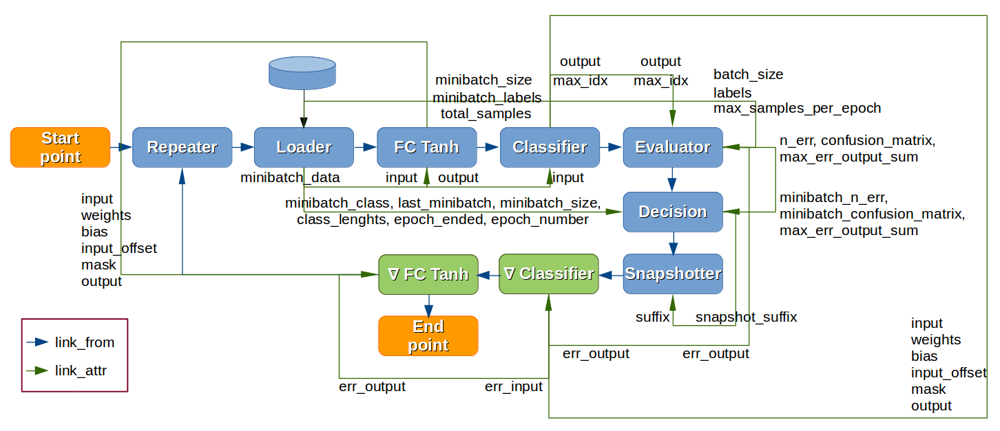
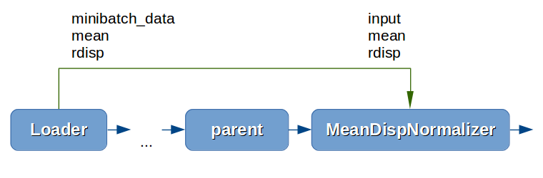
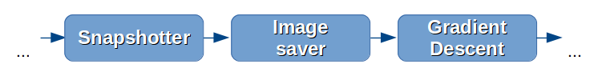
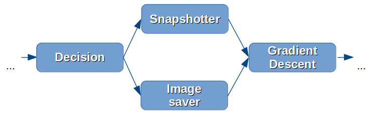
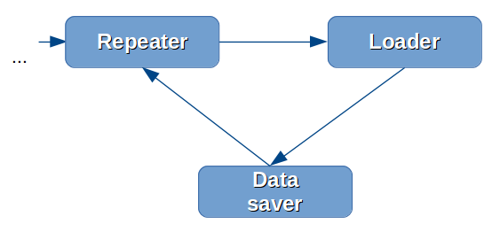
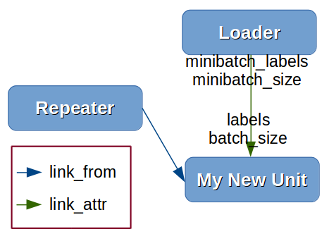
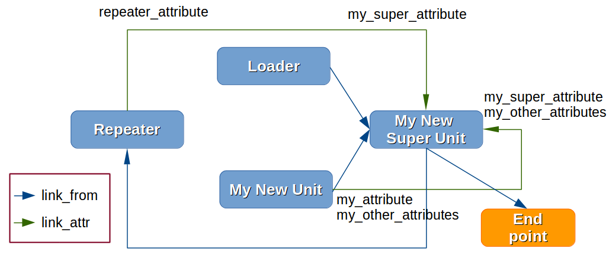
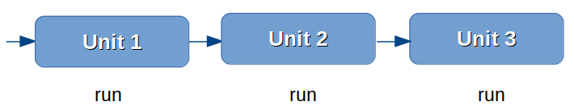
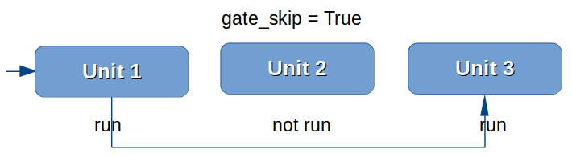
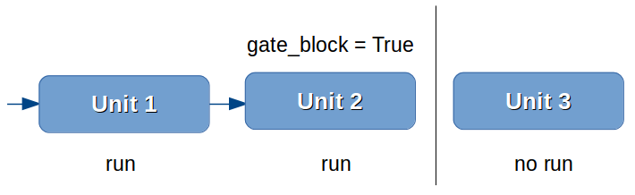

==========================================================
How to create the Workflow. From beginner to professional.
==========================================================

How to create Workflow with StandardWorkflow help
:::::::::::::::::::::::::::::::::::::::::::::::::

Classes :class:`veles.znicz.standard_workflow.StandardWorkflow` and
:class:`veles.znicz.standard_workflow.StandardWorkflowBase` are auxiliary
classes to easily create a Fully Connected or Convolutional Models.

Using StandardWorkflow. Setting parameters.
-------------------------------------------

The easiest way to create your own model is to use Standard Workflow. First,
create the file named "my_worflow.py" and import StandardWorkflow

.. code-block:: python

   from veles.znicz.standard_workflow import StandardWorkflow

Next, you need to create :func:`run` function with :func:`load` and
:func:`main` methods. It is obligatory for each workflow file. :func:`load`
creates the instance of the specified workflow type and returns tuple
(workflow, snapshot). :func:`main` initializes and runs it

.. code-block:: python

   def run(load, main)
       load(StandardWorkflow)
       main()

Workflow is almost ready. We can set it's parameters in
:func:`load`. For the StandardWorkflow obligatory parameters are:
``layers``, ``loader_name`` and ``loader_config``.
``layers`` defines structure of Model and parameters for each layer.
``loader_name`` defines the name of Loader, which will be used to read data.
Finally, ``loader_config`` defines loader parameters. To define parameters,
we need to add them in :func:`load` function

.. code-block:: python

   def run(load, main)
       load(StandardWorkflow,
            loader_name="lmdb",
            loader_config={"train_path": "Desktop/ilsvrc12_train_lmdb"},
            layers=[{"type": "all2all_tanh"}, {"type": "softmax"}])
       main()

You can find all the supported parameters with descriptions and default
values in :doc:`manualrst_veles_workflow_parameters`. Passing parameters
via :class:`veles.config.Config` instances is supported as well (see
:doc:`manualrst_veles_config`)

.. code-block:: python

  from veles.config import root
  from veles.znicz.standard_workflow import StandardWorkflow

  def run(load, main)
      load(StandardWorkflow,
           loader_name=root.my_workflow.loader_name,
           loader_config=root.my_workflow.loader,
            layers=root.my_workflow.layers)
      main()

Create my_workflow_config.py file and define parameters there.

.. code-block:: python

  from veles.config import root

  root.my_workflow.update({
      "loader_name": "lmdb",
      "loader": {"train_path": "Desktop/ilsvrc12_train_lmdb"},
      "layers": [{"type": "all2all_tanh"}, {"type": "softmax"}]})

The workflow and the configuration are ready.

.. note:: if you set loader_config (or any other something_config) as config object (like root.my_workflow.loader), all parameter names in this config object must exactly match with parameters of Class, which they are assigned (:class:`veles.znicz.loader.loader_lmdb.LMDBLoader` in example case). If this Class gets any other or wrong parameters, you will see a warning or error.

Overriding :func:`create_workflow()` in subclass of StandardWorkflow.
---------------------------------------------------------------------

You can change :func:`create_workflow()` to link existing units in different
order or to add `link_functions` (see below) in Workflow. You can see the
default :func:`create_workflow()` in
:class:`veles.znicz.standard_workflow.StandardWorkflow`

.. code-block:: python

  def create_workflow(self):
      # Add repeater unit
      self.link_repeater(self.start_point)

      # Add loader unit
      self.link_loader(self.repeater)

      # Add forwards units
      self.link_forwards(("input", "minibatch_data"), self.loader)

      # Add evaluator unit
      self.link_evaluator(self.forwards[-1])

      # Add decision unit
      self.link_decision(self.evaluator)

      # Add snapshotter unit
      self.link_snapshotter(self.decision)

      # Add gradient descent units
      self.link_gds(self.snapshotter)

      # Loop workflow
      self.link_loop(self.gds[0])

      # Add end_point unit
      self.link_end_point(self.snapshotter)

:func:`create_workflow()` consists of `link functions` calls, which link each unit
with the previous one.
Previous unit (unit to link with) is passed as `link function` argument.
Here is an example of `link function`, which links
:class:`veles.znicz.mean_disp_normalizer.MeanDispNormalizer` unit

.. code-block:: python

  def link_meandispnorm(self, *parents):
      # creating instance of unit
      self.meandispnorm = MeanDispNormalizer(self)

      # linking attributes
      self.meandispnorm.link_attrs(self.loader,
                                   ("input", "minibatch_data"),
                                   "mean", "rdisp")
      # linking by control flow
      self.meandispnorm.link_from(*parents)

      # return instance
      return self.meandispnorm

`link function` creates an instance of the unit, makes some of it's attributes
reference the other, belonging to the existing units (in this case, loader's)
and defines the control flow order. `link function` returns
an instance of the freshly linked unit.

Read more about linking units at :doc:`manualrst_veles_units`

One `link function` links exactly one instance of the unit.

.. note:: Useful convention: the names of instances always correspond to the names of `link functions`. For example, `self.meandispnorm` corresponds to :func:`link_meandispnorm`.

To create Workflow with custom topology, import a
:class:`veles.znicz.standard_workflow.StandardWorkflow`, create a subclass of
StandardWorkflow and redefine :func:`create_workflow()` function.

1. Serial linking.
To add a unit (e.g., image_saver) sequentially
(snapshotter -> image_saver -> gds),  you need to add that unit with
`link function` (self.link_image_saver) and pass the previous unit
(self.snapshotter) as an argument to this  `link function`. The next unit
(gds) links with our unit (image_saver) by self.link_gds `link function`
with self.image_saver argument

.. code-block:: python

  from veles.znicz.standard_workflow import StandardWorkflow

  class MyWorkflow(StandardWorkflow):
      def create_workflow(self):
          ...

          # Add snapshotter unit
          self.link_snapshotter(self.decision)

          # Add image_saver unit
          self.link_image_saver(self.snapshotter)

          # Add gradient descent units
          self.link_gds(self.repeater, self.image_saver)
          ...

2. Parallel linking. You need the full list of parental units for link_gds
with 2 `link functions`: link_image_saver and link_snapshotter with self.decision
argument (previous unit) to add units (image_saver and snapshotter) parallel
between decision and gds.

.. code-block:: python

  from veles.znicz.standard_workflow import StandardWorkflow

  class MyWorkflow(StandardWorkflow):
      def create_workflow(self):
          ...

          # Add decision unit
          self.link_decision(self.evaluator)

          # Add snapshotter and image_saver unit
          end_units = [self.link_snapshotter(self.decision),
                       self.link_image_saver(self.decision)]

          # Add gradient descent units
          self.link_gds(*end_units)
          ...

3. Loop linking.
You need Repeater unit and ``link_loop`` function to loop units (e.g.
repeater, loader, datasaver) in the workflow.
You should add a repeater, loader, datasaver consecutively and then add
``link_loop``, which links argument (self.datasaver) unit with repeater to
add 3 units (repeater, loader, datasaver) as a loop.

.. code-block:: python

  from veles.znicz.standard_workflow import StandardWorkflow

  class MyWorkflow(StandardWorkflow):
      def create_workflow(self):
          self.link_repeater(self.start_point)
          self.link_loader(self.repeater)
          self.link_datasaver(self.loader)
          self.link_loop(self.datasaver)

List of all existing `link functions` with descriptions you
can see here: :class:`veles.znicz.standard_workflow.StandardWorkflow`.

Redefining and creating `link_functions`
----------------------------------------

Also, you can redefine any `link function` or can create your own
`link functions` for existing or custom units. For example, if your data is
in exotic format, you can add custom Loader and link it in
:func:`create_workflow()`

.. code-block:: python

  from veles.znicz.loader import Loader
  from veles.znicz.standard_workflow import StandardWorkflow

  class MyLoader(Loader):
      ...

  class MyWorkflow(StandardWorkflow):
      def create_workflow(self):
          # Add repeater unit
          self.link_repeater(self.start_point)

          # Add loader unit
          self.link_loader(self.repeater)
          ...

      def link_loader(self, *parents):
          self.loader = MyLoader(self)
          self.loader.link_from(*parents)

How to create Abstract Workflow
:::::::::::::::::::::::::::::::

Class :class:`veles.znicz.nn_units.NNWorkflow` is a base class to create any
abstract Workflow (Model).

For creating a unique Model (like Recurrent Neural Network or any other not
trivial linked Workflow), you can use
:class:`veles.znicz.nn_units.NNWorkflow` class. The rules are the same: we
create instances of units, link them by control flow using :meth:`link_from`
and link their attributes using :meth:`link_attr`. We can link anything
to anything and transmit any data from any unit to any unit. Example:

.. code-block:: python

  class MyLoader(Loader):
      ...

  class MyNewUnit(Unit):
      ...

  class MyNewSuperUnit(Unit):
      ...

  class MyAbstractWorkflow(nn_units.NNWorkflow):
      def __init__(self, workflow, layers, **kwargs):
          super(MyAbstractWorkflow, self).__init__(workflow, **kwargs)

          self.repeater.link_from(self.start_point)

          self.loader = MyLoader(self, minibatch_size=60)
          self.loader.link_from(self.repeater)

          self.my_new_unit = MyNewUnit(self, my_parameter="parameter")
          self.my_new_unit.link_from(self.repeater)
          self.my_new_unit.link_attrs(
              self.loader,
              ("labels", "minibatch_labels"),
              ("batch_size", "minibatch_size"))

          self.my_new_super_unit = MyNewSuperUnit(
              self, my_super_parameter=(42, 24))
          self.my_new_super_unit.link_from(self.loader)
          self.my_new_super_unit.link_from(self.my_new_unit)
          self.my_new_super_unit.link_attrs(
              self.repeater, ("my_super_attribute", "repeater_attribute"))
          self.my_new_super_unit.link_attrs(
              self.my_new_unit,
              ("my_super_attribute", "my_attribute"),
              "my_other_attributes")

          self.repeater.link_from(self.my_new_super_unit)
          self.end_point.link_from(self.my_new_super_unit)
          ...

We construct this Workflow:

.. image:: _static/abstract_workflow.png

Take a closer look at this example. Instances of Repeater, StartPoint and
EndPoint is created by default. First, we link repeater with start point.

.. code-block:: python

  self.repeater.link_from(self.start_point)

Next, we create an instance of MyLoader and link it with Repeater.

.. code-block:: python

  self.loader = MyLoader(self, minibatch_size=60)
  self.loader.link_from(self.repeater)

Then, we create an instance of MyNewUnit, link it with Repeater and
associate Loader's and MyNewUnit's attributes.

.. code-block:: python

  self.my_new_unit = MyNewUnit(self, my_parameter="parameter")
  self.my_new_unit.link_from(self.repeater)
  self.my_new_unit.link_attrs(
      self.loader,
      ("labels", "minibatch_labels"),
      ("batch_size", "minibatch_size"))

Finally, we create MyNewSuperUnit, link it with Loader and with MyNewUnit,
transmit attributes from Repeater and MyNewUnit and link MyNewSuperUnit
with Repeater.

.. code-block:: python

  self.my_new_super_unit = MyNewSuperUnit(
      self, my_super_parameter=(42, 24))
  self.my_new_super_unit.link_from(self.loader)
  self.my_new_super_unit.link_from(self.my_new_unit)
  self.my_new_super_unit.link_attrs(
      self.repeater, ("my_super_attribute", "repeater_attribute"))
  self.my_new_super_unit.link_attrs(
      self.my_new_unit,
      ("my_super_attribute", "my_attribute"),
      "my_other_attributes")

  self.repeater.link_from(self.my_new_super_unit)

More about linking units: :doc:`manualrst_veles_units`

How to stop, pause or skip the run of unit
::::::::::::::::::::::::::::::::::::::::::

.. code-block:: python

   self.unit2.link_from(self.unit1)
   self.unit3.link_from(self.unit2)

Every unit has 2 attributes: ``gate_skip`` and ``gate_block``. The unit doesn't
run and pass control flow to the next unit If ``gate_skip`` is True.

.. code-block:: python

   self.unit2.link_from(self.unit1)
   self.unit3.link_from(self.unit2)
   self.unit2.gate_skip = True

The unit doesn't run and doesn't pass control flow to the next unit if
``gate_block`` is True.

.. code-block:: python

   self.unit2.link_from(self.unit1)
   self.unit3.link_from(self.unit2)
   self.unit2.gate_block = True

Example:

.. code-block:: python

   self.snapshotter.gate_skip = ~self.decision.epoch_ended

While self.decision.epoch_ended is not True, self.snapshotter.gate_skip is True,
so Snapshotter runs when self.decision.epoch_ended is True and only then.

.. code-block:: python

   self.end_point.gate_block = ~self.loader.train_ended

End_point runs when self.loader.train_ended is True and only then.